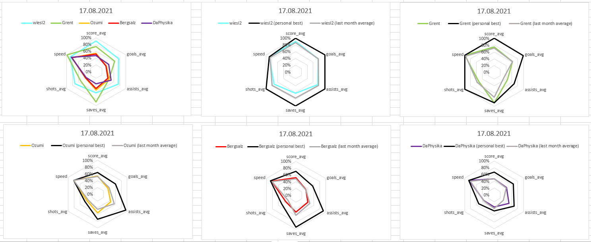
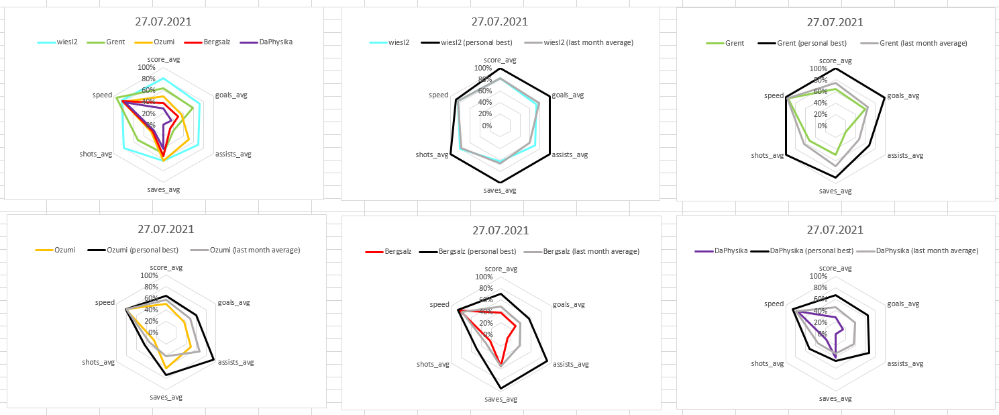

# Charts for Stats of OATZ Rocket League Tuesdays

[OATS Rocket League](https://www.oatz.net/rocketleague)

[OATS Rocket League - All data](https://www.oatz.net/rocketleague/all)

[Github Pages](https://mjhalwa.github.io/oatzcharts/)

## Requirements

1. Linux OS or WSL to access `bash` commands like `sed`, `cat`, `echo`, ...
2. bash-package `jq`

    ``` bash
    sudo apt-get install jq
    ```

3. Microsoft Excel for Proof of Concept Graphics

## Create Graphics

1. get all JSON data from [OATS Rocket League API](https://www.oatz.net/rocketleague/api/all)

    ``` bash
    curl https://www.oatz.net/rocketleague/api/all | jq "." > data.json
    ```

2. create Excel-importable csv table from `data.json`

    ``` bash
    bash json2csv.sh
    ```

    creates
    - `data.csv` extracted stats in tabular format: `date | username | ...stats`
    - `data_ger.csv` for opening with German MS Excel (',' comma)

3. open `data.csv` in Excel and copy data into first Tab of `data.xslx` (+ extend first column in this tab to the new table size)

## Proof of Concept

### 17.8.2021



### 27.7.2021



## dev-server

run dev server on each `npm start`, see [stackoverflow](https://stackoverflow.com/questions/37078968/how-to-specify-the-path-of-package-json-to-npm)

``` bash
npm --prefix /path/to/project run build
```
