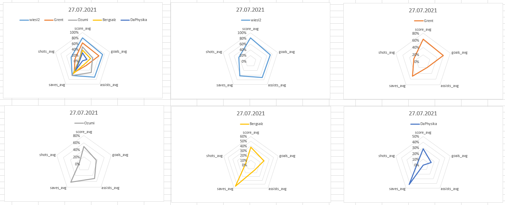

# Charts for Stats of OATZ Rocket League Tuesdays

## Requirements

1. Linux OS or WSL to access `bash` commands like `sed`, `cat`, `echo`, ...
2. Microsoft Excel for Proof of Concept Graphics

## Create Graphics

1. update data from [OATS Rocket League](https://www.oatz.net/rocketleague/)

    ``` bash
    bash webscraper.sh
    ```

    creates
    - `raw.html` HTML-Website as is
    - `filtered.html` only relevant HTML elements
    - `data.csv` extracted stats in tabular format: `date | username | ...stats`
    - `data_ger.csv` for opening with German MS Excel (','  comma)

2. import updated data in `data.xslx`

## Proof of Concept

